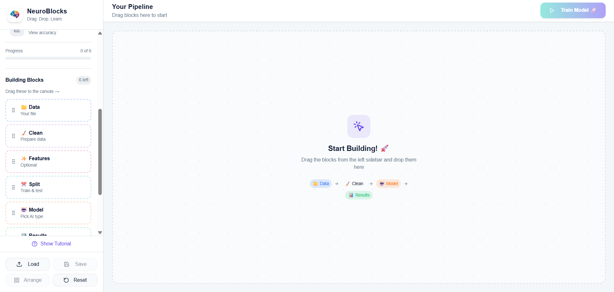

# NeuroBlocks

A drag-and-drop playground for teaching beginners how end-to-end ML pipelines come together. Users can upload datasets, configure preprocessing, select models, and trigger guided training flows—all inside a vibrant React + Vite experience backed by Supabase Functions for AI explanations.



## ✨ Features

1. **Visual pipeline builder** – Drag dataset, preprocessing, feature engineering, split, model, and results blocks onto the canvas with live status indicators.
2. **Contextual help + AI tutor** – Inline guides plus Supabase Function (`explain-step`) that calls Lovable AI to explain each step in plain language.
3. **Dataset-aware configuration** – Upload CSV/Excel files, inspect column metadata, and drive subsequent block configuration.
4. **Smart suggestions & tutorials** – Onboarding walkthrough, block suggestions, auto-arrange, and save/load utilities to keep users oriented.
5. **Polished UI** – Built with shadcn/ui, Radix primitives, Lucide icons, and tasteful gradients/animations for a modern feel.

## 🏗️ Tech Stack

- **Frontend:** React 18, Vite, TypeScript, React DnD, @tanstack/react-query, shadcn/ui (Radix + Tailwind)
- **State & data:** React hooks/state, localStorage persistence for tutorials, toast feedback via Sonner
- **Styling:** Tailwind CSS, custom utility classes, CSS animations
- **Backend helpers:** Supabase JavaScript client + Edge Function (`supabase/functions/explain-step`) hitting Lovable AI Gateway

## 📁 Directory Highlights

| Path | Purpose |
| --- | --- |
| `src/components/pipeline` | Core drag-and-drop experience (builder, nodes, drawers, suggestions, results). |
| `src/components/ui` | shadcn/ui components and wrappers used across the app. |
| `src/integrations/supabase` | Generated Supabase client + typed Database definitions. |
| `supabase/functions/explain-step` | Deno-edge handler that returns beginner-friendly explanations powered by Lovable AI. |

## 🚀 Getting Started

### Prerequisites

- Node.js 18+
- npm (or pnpm/yarn if you prefer; examples use npm)
- Supabase CLI (optional, only needed to run/deploy the Edge function)

### Installation

```bash
git clone <repo-url>
cd flow-canvas-main
npm install
```

### Environment Variables

Create a `.env` file at the project root with:

```
VITE_SUPABASE_URL=YOUR_SUPABASE_PROJECT_URL
VITE_SUPABASE_PUBLISHABLE_KEY=YOUR_SUPABASE_ANON_KEY
```

The Edge function also needs a Lovable AI key:

```
LOVABLE_API_KEY=YOUR_LOVABLE_GATEWAY_KEY
```

Set this in the Supabase Dashboard (Project Settings → Functions → Environment Variables) or load it locally when serving the function.

### Available Scripts

| Script | Description |
| --- | --- |
| `npm run dev` | Start Vite dev server (default `http://localhost:8080`). |
| `npm run build` | Production build. |
| `npm run build:dev` | Build using development mode (useful for staging). |
| `npm run preview` | Preview the production build. |
| `npm run lint` | Run ESLint with the configured rules. |

## ☁️ Supabase Function: `explain-step`

The AI guidance button inside the UI invokes this Edge Function to fetch friendly explanations tailored to the current step and dataset context.

Key files:

- `supabase/functions/explain-step/index.ts` – Deno handler using `serve` and `fetch` to call `https://ai.gateway.lovable.dev/v1/chat/completions`.
- `supabase/functions/_types/deno.d.ts` – Minimal ambient types for `Deno.env` and the remote `serve` import to keep TypeScript happy.
- `supabase/config.toml` – Enables the function and disables JWT verification for simplicity.

### Local testing

```bash
supabase functions serve explain-step --env-file ./supabase/.env.local
```

Provide an env file (or inline export) containing `LOVABLE_API_KEY`. Update the frontend Supabase URL/key to point at your local Supabase instance if needed.

### Deploying

```bash
supabase functions deploy explain-step
supabase functions list   # verify deployment
```

After deployment, ensure the project’s Edge function URL matches what the Supabase client expects (no additional configuration needed if using the same Supabase project).

## 🧠 Developer Notes

- The pipeline can technically run with only the dataset + model blocks, but optional steps improve the “training result” messaging and toasts.
- React DnD coordinates are stored in component state; `PipelineSaveLoad` serializes the layout to JSON for quick reloads.
- Tutorial visibility is tracked in `localStorage` under `ml-builder-tutorial-seen`.

## 🧪 Future Enhancements

- replace the mocked training delay with real model training or remote job orchestration
- log AI explanation failures to Supabase for observability
- add automated tests (component + e2e) once critical flows stabilize

---

Happy building! Drag, drop, and teach ML pipelines with confidence. 🎉
